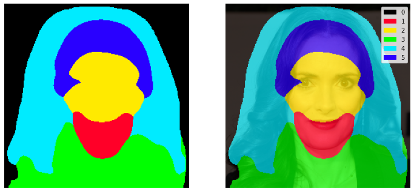

# Motion Supervised co-part Segmentation 
## [Arxiv](http://arxiv.org/abs/2004.03234) | [YouTube video](https://www.youtube.com/watch?v=RJ4Nj1wV5iA) | [Demo](https://docs.google.com/presentation/d/1LnRi_ghHnZ_lB7j8_M_ER0N-SOGFN0HDTbMytfeRlIg/edit?usp=sharing)

Install:

    mtcnn
    
    pixellib

Download [weights](https://drive.google.com/drive/folders/1Zo8Y8xRpHZpzD7Yhj9dy-a9fp6PNEZlI?usp=sharing)
    
    
Run:
<<<<<<< HEAD
    python```
=======

    ```
>>>>>>> 96da24e7e9c68fc4eee772e09a5359a67a4d28d9
    python test_2.py --invid test_1.mp4 --img 1.jpg --outvid out.mp4
    ```
In line 65 of test_2.py, you can change the parts of face that you want swap by "swap_index" element, for example: swap_index=[1,2,3]. This is visualize 5 parts of face:


